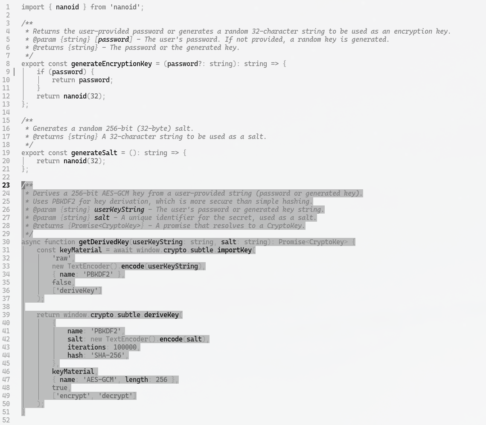

# Snow

A simple, elegant, and light theme for Neovim.

<p align="center">
  
</p>

> A whisper soft, a silent fall,  
> Of crystals drifting, heeding winter's call.  
> A silver blanket, on the dark earth spread,  
> A memory of the green life fled.  
> This is the snow, the soft and white,  
> The quiet dream of a frozen night.  

## Installation

Install with your favorite plugin manager.

### lazy.nvim

Add the following to your `lazy.nvim` configuration:

```lua
{
  "bjarneo/snow.nvim",
  priority = 1000,
  config = function()
    vim.cmd([[colorscheme snow]])
  end,
}
```

## Usage

To use the theme, add the following to your `init.lua`:

```lua
vim.cmd.colorscheme "snow"
```

